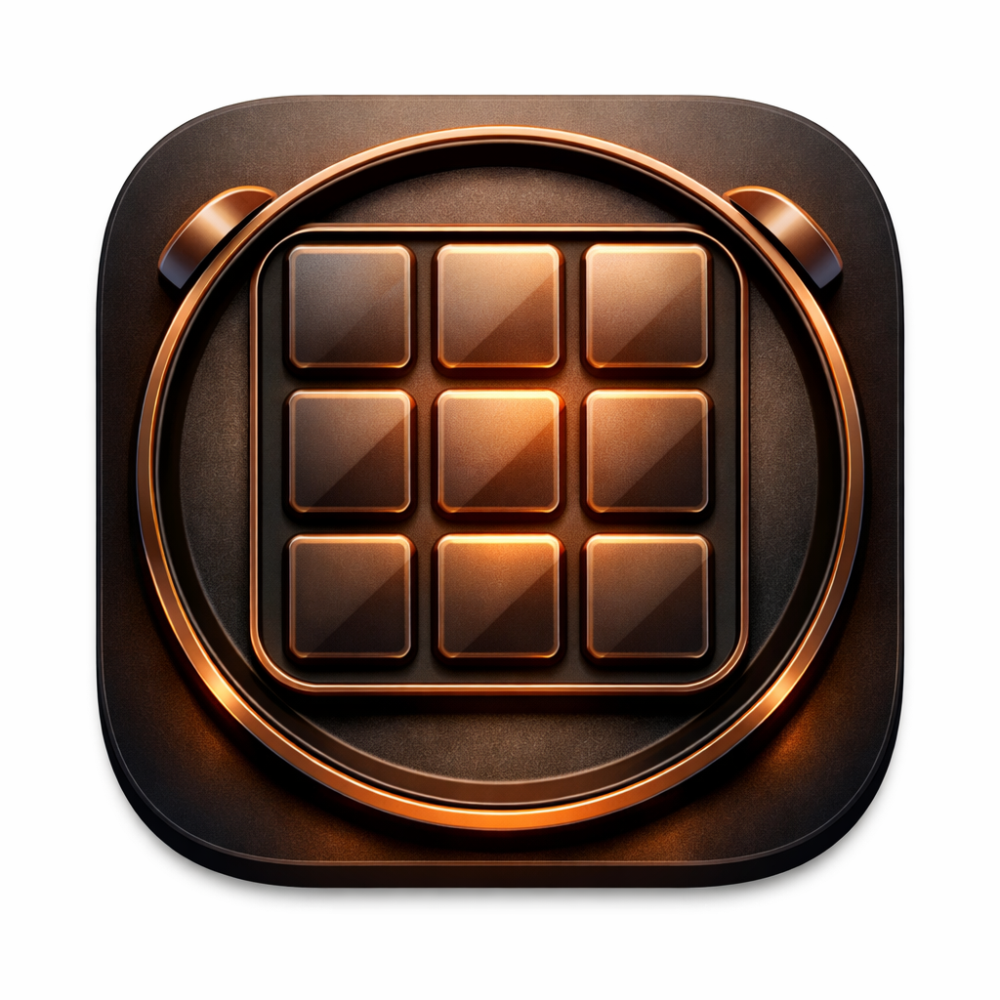
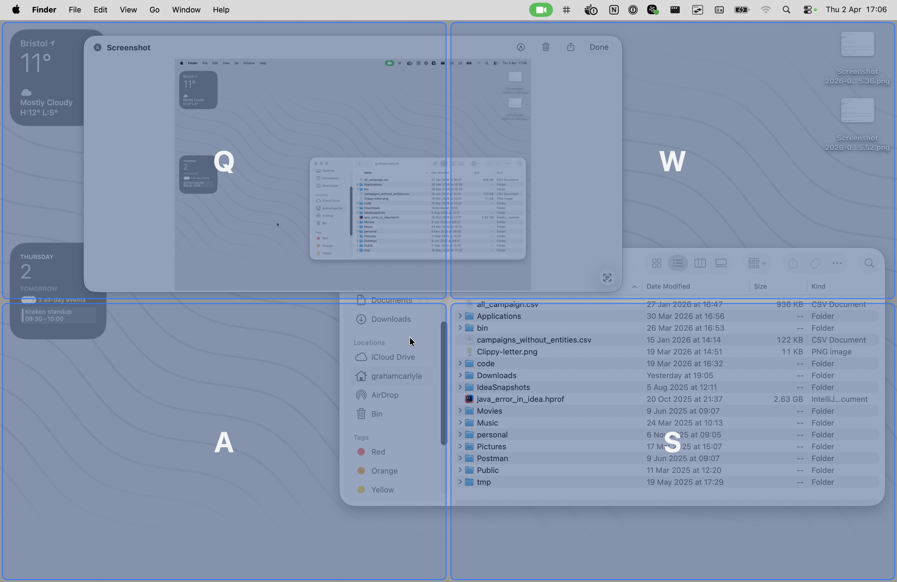

<p align="center">
  
</p>

<h1 align="center">Griddle</h1>

<p align="center">
  Tile your macOS windows with just the keyboard.<br>
  Tap your modifier keys, see a grid, press a letter — done.
</p>

<p align="center">
  
</p>

Griddle is a lightweight menu-bar utility inspired by [GNOME Tactile](https://extensions.gnome.org/extension/4548/tactile/). It lets you snap the focused window into grid positions using global keyboard shortcuts — no mouse required. A translucent HUD overlay shows the grid so you always know where your windows will land.

## Getting started

1. **[Download the latest release](https://github.com/grahamcarlyle/griddle/releases/latest)**
2. Unzip and run `./install.sh` to install to `/Applications` (or pass a custom path: `./install.sh path/to/Griddle.app`)
3. Launch Griddle and grant Accessibility permission when prompted, in **System Settings → Privacy & Security → Accessibility → Griddle**, then relaunch

Requires macOS 13 (Ventura) or later.

See the **[visual feature guide](docs/features.md)** for animated demos of each feature.

## Highlights

- **Instant tiling (hotkey combo)** — modifier + letter key moves the focused window to a grid cell
- **Visual HUD (modifier tap)** — tap modifier keys to toggle a grid overlay on screen
- **Spatial key mapping** — keys match grid positions (Q/W top row, A/S bottom row), or switch to number keys (1–9)
- **Multi-cell spanning** — press two keys to stretch a window across cells
- **Arrow key navigation** — use arrow keys and Enter to select cells without memorising key bindings
- **Custom proportions** — adjust column/row weights with Shift+arrow keys in the HUD for non-uniform grids
- **Customisable grids** — built-in 2×2, 3×2, 3×3 layouts, or create your own (up to 6×4)
- **Per-screen layouts** — assign different grids to different monitors
- **HUD themes** — System, Green, High Contrast, Purple, or Orange
- **Cycle layouts** — modifier + Space to show HUD and cycle through layouts (configurable key)
- **Configurable modifiers** — any combination of Ctrl, Option, Cmd, Shift
- **Runs in the menu bar** — no Dock icon, minimal footprint
- **Launch at login** — start tiling automatically

## How it works

Griddle has three ways to trigger an action:

- **Modifier tap** — tap and release just the modifier keys to toggle the HUD overlay
- **Hotkey combo** — modifier + a letter or number key for an instant move (no HUD)
- **Cycle key** — modifier + Space (configurable) to show the HUD or cycle layouts when the HUD is open

The examples below use the default modifiers (**Ctrl+Alt** on Mac with a US layout) and the 2×2 layout. Substitute your configured modifiers if you've changed them.

**Hotkey combo:** Press Ctrl+Alt+Q to instantly move the window to the top-left cell.

**Cycle key:** Press Ctrl+Alt+Space to show the HUD with the current layout. Press again to cycle to the next layout, then select a cell.

**Modifier tap:** Tap and release Ctrl+Alt to toggle a grid overlay on screen. Then:
- Press a letter key to move the window to that cell
- Press two letter keys to span the window across those cells (e.g. Q then S = full screen)
- Use arrow keys to navigate the grid, then Enter to confirm
- Press two arrows to span across multiple cells (Enter after the first to set the anchor)
- While spanning, press Shift+arrow to adjust column/row proportions (Shift+0 to reset)
- Press Escape or tap the modifier keys again to dismiss

By default, keys are mapped spatially to match the grid layout:

| Key | Position (2×2) |
|-----|----------------|
| Q   | Top-left       |
| W   | Top-right      |
| A   | Bottom-left    |
| S   | Bottom-right   |

For larger grids the mapping extends across the keyboard rows (Q/W/E/R/T/Y, A/S/D/F/G/H, Z/X/C/V/B/N). Grids with more than 3 rows use prefix keys — e.g. in a 4-row grid, press Z then a letter to reach rows 3–4 (the HUD shows the key sequences). You can switch to number keys (1–9) in the settings; grids with more than 9 cells use key 9 as a prefix.

## Alternatives

macOS 15 Sequoia adds edge and corner snapping via Option-drag, which covers the basics for many users. If you need more, here is how the common options compare:

| Tool | Price | Interaction model | Visual HUD | Arbitrary grid | Multi-cell span |
|---|---|---|---|---|---|
| **Griddle** | Free | Hold modifier → press key(s) | Yes | Yes (custom layouts) | Yes |
| macOS 15 built-in | Free | Mouse drag to edge/corner | No | No (fixed zones only) | No |
| Rectangle | Free | Drag to edge or keyboard shortcut | No | No (fixed positions) | No |
| Magnet | $3 | Drag to edge or keyboard shortcut | No | No (fixed positions) | No |
| Moom | $15 | Hover green button or shortcuts | Partial (button pop-up) | Yes (saved layouts) | Yes |
| BetterSnapTool | $3 | Modifier + drag | No | Yes (custom snap areas) | No |
| Amethyst | Free | Automatic (xmonad-style tiling) | No | — | — |
| Yabai | Free | CLI / scripting | No | — | — |

**Prefer Griddle if** you want to place windows without touching the mouse, see exactly where a window will land before it snaps, and define your own grid rather than working from a fixed set of positions.

**Prefer Rectangle or Magnet if** drag-to-edge snapping or a handful of keyboard shortcuts covers your workflow and you don't need a visual overlay.

**Prefer Moom if** you need saved multi-app layouts, per-app rules, or pixel-level positioning.

**Prefer Amethyst or Yabai if** you want windows to tile themselves automatically rather than placing them manually.

## Building from source

Requires the Swift toolchain (managed via [mise](https://mise.jdx.dev/)).

```bash
./build.sh                                       # Build + package as .app bundle
./install.sh                                     # Install to /Applications and remove quarantine
open /Applications/Griddle.app                   # Run
```

**Optional: stable signing for local development**

By default `build.sh` signs the bundle ad-hoc, which means macOS treats each rebuild as a new app and forces you to re-grant Accessibility permission. To keep the grant across rebuilds, create a self-signed Code Signing certificate once:

1. Open **Keychain Access**
2. Menu: **Keychain Access → Certificate Assistant → Create a Certificate…**
3. Name: `Griddle Dev`, Identity Type: **Self Signed Root**, Certificate Type: **Code Signing**
4. Click **Create**, then **Done**

Subsequent `./build.sh` runs will detect the identity and sign with it. Override the name via `GRIDDLE_SIGN_IDENTITY=<name> ./build.sh` if you prefer a different label.

## Configuration

Settings are available via the menu-bar icon (grid icon). You can:
- Switch between grid layouts or add custom ones (up to 6 columns × 4 rows)
- Assign different layouts to different screens
- Choose between spatial letter keys (Q/W/A/S) or number keys (1–9)
- Pick a HUD colour theme
- Adjust column/row proportions via sliders or Shift+arrow keys in the HUD
- Choose modifier keys
- Change the layout cycle key (Space, Tab, /, 0, −, =)
- Enable launch at login

The config file lives at `~/.config/griddle/config.json` and is automatically updated when you change settings. You can also define custom layouts with non-uniform cells (different `colSpan`/`rowSpan`) directly in the JSON.
