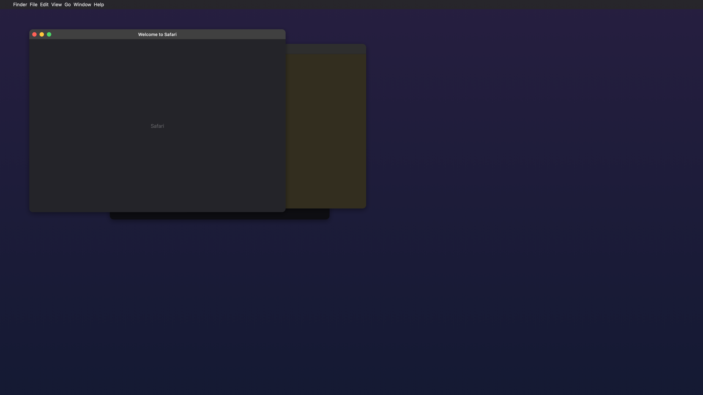
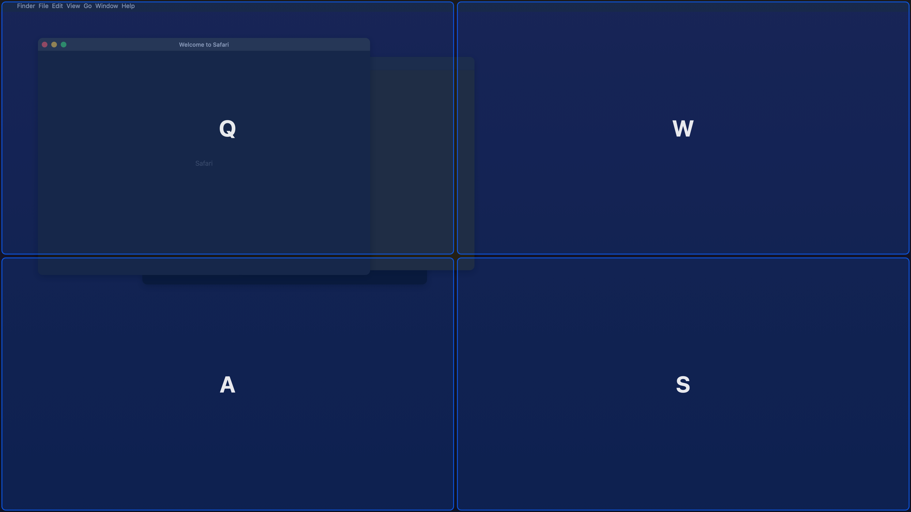
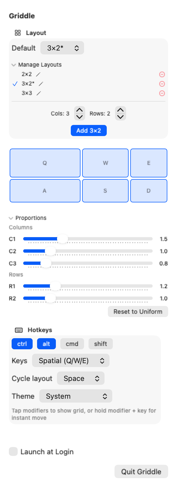

# Griddle Features

Visual guide to Griddle's key features. Each animation shows the feature in action.

## Window Tiling

Tap your modifier keys (default: Ctrl+Alt) to show the grid overlay, then press a cell key to instantly tile the focused window.

## Multi-Cell Spanning

Press two cell keys to stretch a window across multiple cells. The first key sets the anchor, the second defines the opposite corner of the region.

## Arrow Key Navigation

Use arrow keys to move a cursor through the grid without memorising key bindings. Press Enter to set the anchor, then arrow keys to expand the selection, and Enter again to tile.

## Custom Proportions

While in the expanding selection, press Shift+arrow keys to adjust column and row weights. The grid resizes in real time so you can dial in exactly the proportions you want. Press Shift+0 to reset to uniform.

## HUD Themes

Choose from five colour themes in the settings: System (default), Green, Purple, Orange, and High Contrast.

## Settings

All settings are available from the menu bar icon. Choose grid layouts, modifier keys, key style, HUD theme, and manage custom layouts with proportions sliders.

